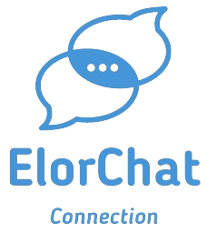

# ElorChat Server

## Descripción del Proyecto

ElorChat Server es el servidor dedicado a la comunicación entre clientes y servidor en la aplicación movil Elorchat.

## Built With

Para el apartado del server en Java se ha utilizado:

- [Hibernate](https://hibernate.org/) - Framework de mapeo objeto-relacional.
- [Maven](https://maven.apache.org/) - Herramienta de gestión de proyectos.
- [Spring Boot](https://spring.io/projects/spring-boot) - Framework de desarrollo de aplicaciones.
- [Spring Security](https://spring.io/projects/spring-security) - Framework de seguridad.
- [Spring Data JPA](https://spring.io/projects/spring-data-jpa) - Framework de persistencia.
- [Spring Web](https://spring.io/projects/spring-framework) - Framework de desarrollo web.
- [MySQL](https://www.mysql.com/) - Base de datos.
- [Lombok](https://projectlombok.org/) - Biblioteca para reducir el código boilerplate.
- [Swagger](https://swagger.io/) - Framework de documentación de APIs.
- [Socket.io](https://socket.io/) - Framework de comunicación en tiempo real.
- [Firebase](https://firebase.google.com/) - Plataforma de desarrollo de aplicaciones móviles.

## Funcionalidades
- Login y primer inicio de sesión.
- Cambio de contraseña.
- confirmación de datos personales.
- Envío de mensajes en tiempo real.
- Comunicación en tiempo real.
- Creacion y gestión de chats.

## Seguridad

-Las contraseñas viajan cifradas por la red mediante clave pública. El par de claves se generan y
   almacenan externamente al código.

-JWT para la autenticación de usuarios.

### Instalación

1. Clonar el repositorio
   git clone https://github.com/JonGallego97/reto2_chat_server.git
2. Importar el proyecto en un IDE (Eclipse, IntelliJ, NetBeans, etc) como proyecto Maven.
3. Configurar el archivo application.properties con los datos de la base de datos.

## Inicio Rápido

1. Ejecutar el proyecto en el IDE.
2. Acceder a la URL http://localhost:8080/swagger-ui.html para ver la documentación de la API.

### Prerrequisitos

- Tener instalado un IDE (Eclipse, IntelliJ, NetBeans, etc).
- Tener instalado Maven.
- Tener instalado MySQL.
- Tener la base de datos creada con las migraciones de Laravel o ejecutar el script de la base de datos.

### Contacto
- Gorka Gabiña - gorka.gabiname@elorrieta-errekamari.com
- Jon Gallego - jon.gallegoaz@elorrieta-errekamari.com
- Milena Cuellar - milena.cuellarpa@elorrieta-errekamari.com
- Aimar Pelea - aimar.peleaar@elorrieta-errekamari.com

## Licencia
- Este proyecto está bajo la Licencia MIT

